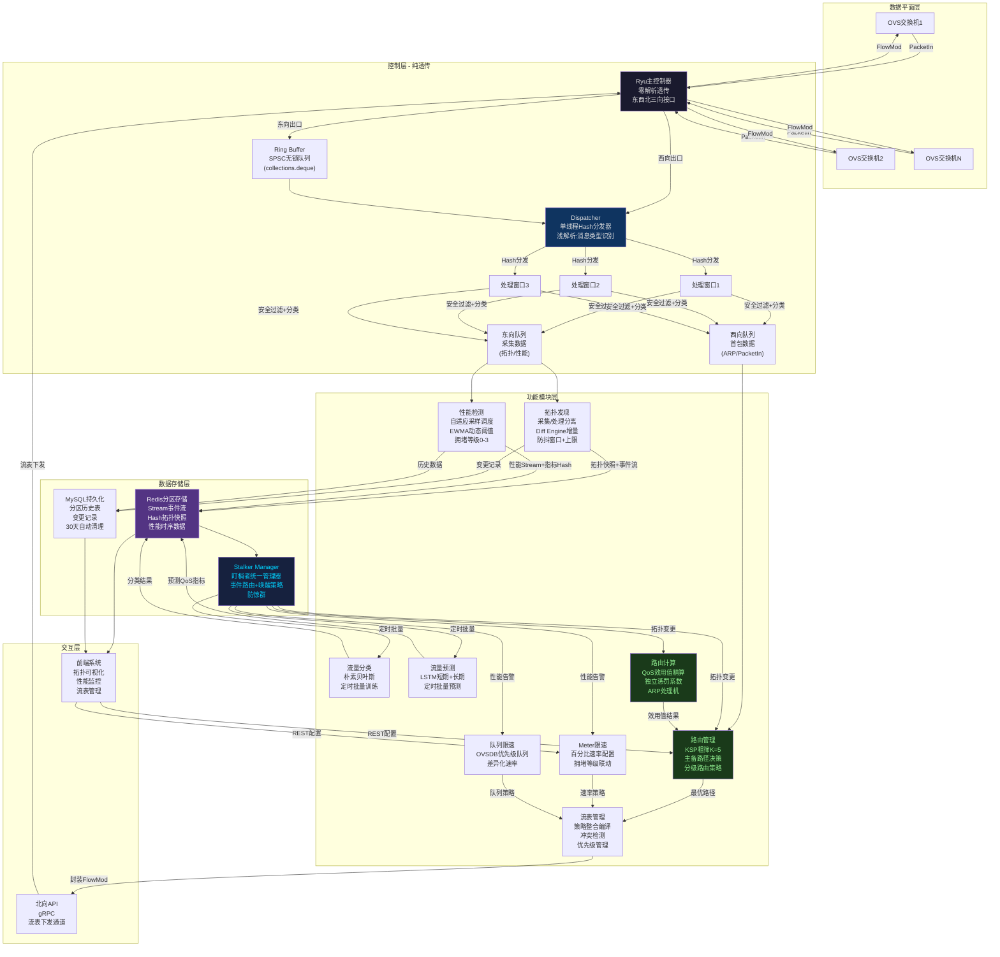

# 面向多业务 QoS 的分布式透传 SDN 架构 — 最终工程化方案

> 原则：完整保留原设计创新点，剔除不切实际/过度设计，细化所有模糊边界，给出可直接编码的接口规范。

---

## 目录

1. [整体架构（Mermaid 图）](#1-整体架构)
2. [主控制器模块](#2-主控制器模块)
3. [消息队列模块](#3-消息队列模块)
4. [拓扑发现模块](#4-拓扑发现模块)
5. [性能检测模块](#5-性能检测模块)
6. [分区数据库 + 盯梢者架构](#6-分区数据库--盯梢者架构)
7. [QoS-KPS 路由决策](#7-qos-kps-路由决策)
8. [流表管理模块](#8-流表管理模块)
9. [限速模块（Meter + 队列）](#9-限速模块meter--队列)
10. [流量分类 + 流量预测模块](#10-流量分类--流量预测模块)
11. [前端系统](#11-前端系统)
12. [Redis Key 规范](#12-redis-key-规范)
13. [MySQL 表结构](#13-mysql-表结构)
14. [目录结构](#14-目录结构)
15. [修改汇总表](#15-修改汇总表)

---

## 1. 整体架构



---

## 2. 主控制器模块

### ✅ 保留的创新设计

| 设计点 | 说明 |
|--------|------|
| **纯透传** | 主控不做任何业务处理，仅作为数据通道 |
| **东西北三向接口** | 东向=采集数据出口，西向=首包数据出口，北向=流表下发入口 |
| **metadata 分类** | 通过流表预设 metadata 字段区分东/西向消息 |

### ❌ 去除的内容

| 去除项 | 原因 | 替代方案 |
|--------|------|---------|
| DMA/vhost-user 直通 | 依赖特殊硬件（SR-IOV 网卡 + DPDK），Mininet/普通服务器不可实现 | 改为标准 `collections.deque` Ring Buffer，软件层面零拷贝通过引用传递 |
| 安全过滤在主控串行 | 违背纯透传原则，主控应不做任何解析 | 安全过滤下沉到三个处理窗口，各自独立执行 |
| "0.05ms DMA 拷贝" 性能声明 | 硬件依赖不可复现 | 改为定性描述"低延迟透传"，不做定量承诺 |

### 🔧 细化的内容

**metadata 标签机制明确化：**

```
metadata 标签由「流表管理模块」在下发初始流表时预设：
  - 流表规则 A: match=LLDP(ethertype=0x88CC) → metadata=1, output=CONTROLLER
  - 流表规则 B: match=ARP  → metadata=2, output=CONTROLLER
  - 流表规则 C: match=IP   → metadata=2, output=CONTROLLER
  - 默认流表: match=*      → metadata=2, output=CONTROLLER

交换机在匹配流表时自动写入 metadata 字段，主控仅读取 OpenFlow 消息头中的 metadata 字段（无需深度解析数据包）：
  - metadata == 1 → 东向出口（采集数据）
  - metadata == 2 → 西向出口（首包触发）
```

### 📐 接口定义

```python
class SDNController(ryu.base.app_manager.RyuApp):
    """
    纯透传主控制器
    - 东向出口: self.east_ring (SPSC Ring Buffer)
    - 西向出口: self.dispatcher (直接调用)
    - 北向入口: self.north_handler (接收 FlowMod)
    """

    def __init__(self):
        self.east_ring = RingBuffer(capacity=4096)   # SPSC 环形缓冲区
        self.dispatcher = Dispatcher(num_workers=3)   # 三窗口分发器
        self.north_handler = NorthBoundHandler(self)  # 北向 RPC 入口

    def packet_in_handler(self, ev):
        """所有 PacketIn 的消息处理入口"""
        msg = ev.msg
        # 仅读取 metadata 字段（OpenFlow 消息头字段，零深度解析）
        metadata = msg.match.get('metadata', 0)

        if metadata == 1:
            self.east_ring.push(msg)       # 东向：投入 Ring Buffer
        else:
            self.dispatcher.dispatch(msg)  # 西向：直接分发到处理窗口
```

### 📦 北向接口

```python
class NorthBoundHandler:
    """
    北向入口：接收流表管理模块的 FlowMod 请求
    通过 gRPC 暴露接口，主控仅做序列化转发
    """
    def receive_flow_mods(self, flow_mods: List[FlowModRequest]) -> bool:
        """批量接收 FlowMod，下发到对应交换机，返回是否全部成功"""
        for fm in flow_mods:
            datapath = self._get_datapath(fm.dpid)
            datapath.send_msg(fm.to_openflow())
        return True
```

---

## 3. 消息队列模块

### ✅ 保留的创新设计

| 设计点 | 说明 |
|--------|------|
| **三窗口并行处理** | 三个功能完全一致的处理窗口，实现并发处理 |
| **降级队列概念** | 低流量时避免队列开销，高流量时削峰填谷 |
| **窗口浅解析 + 数据结构化** | 窗口对消息做浅层分类和标准化封装 |
| **东/西两条业务队列** | 东向→拓扑队列+性能队列，西向→首包队列 |

### ❌ 去除的内容

| 去除项 | 原因 | 替代方案 |
|--------|------|---------|
| 三窗口类 RAFT 协议 | 单机场景下不存在分布式共识问题，RAFT 是严重过度设计 | 改用 Redis Stream 持久化 + Consumer ACK |
| "无锁直接写入"宣称 | 三个窗口写入同一条队列必须有锁（隐藏在 Python `queue.Queue` 内部） | 如实描述为"线程安全队列" |
| LLDP 时延计算在窗口层 | 属于性能检测模块职责，不应放在消息队列层 | 移到性能检测 Handler |

### 🔧 细化的内容

**降级队列实现细节：**

```
降级队列设计（保留概念，明确实现）：

方案：固定使用 SPSC Ring Buffer，始终走队列路径
- 原因：Python collections.deque 入队/出队开销在纳秒级
- 低流量时 Ring Buffer 几乎无等待，延迟可忽略
- 不需要"判断流量大小→动态切换"的复杂逻辑
- 避免了阈值震荡问题
- 保留了削峰填谷的核心价值

Ring Buffer 实现：
  - 容量: 4096 条消息（可配置）
  - 满时策略: 丢弃最旧消息（FIFO drop），记录 metrics
  - 实现: collections.deque(maxlen=4096) + threading.Lock（仅 push 端加锁）
```

**Dispatcher 分发机制：**

```python
class Dispatcher:
    """
    单线程 Hash 分发器
    - 对每个 PacketIn 的 (dpid, in_port) 做 hash
    - 分发到固定窗口，同一交换机同一端口的消息到同一窗口
    - 避免同一流的多包分散到不同窗口导致的乱序
    """
    def __init__(self, num_workers=3):
        self.workers = [Worker(i) for i in range(num_workers)]

    def dispatch(self, msg):
        key = (msg.datapath.id, msg.match.get('in_port', 0))
        idx = hash(key) % len(self.workers)
        self.workers[idx].handle(msg)
```

**浅解析边界定义：**

```
浅解析：仅解析以下内容——
  1. OpenFlow 消息头: metadata 字段（分类东/西）
  2. 以太网帧头: ethertype（识别 ARP/IP/LLDP）
  3. 不做任何 L3+ 解析

深解析（由下游 Handler 执行）：
  - LLDP TLV 解析、时间戳提取（→ 性能检测 Handler）
  - IP 五元组提取（→ 首包处理 Handler）
  - ARP 载荷解析（→ 路由计算模块 ARP 处理机）
```

**处理窗口功能：**

```python
class Worker:
    """
    单个处理窗口，功能：
    1. 安全过滤（独立执行，不影响其他窗口）
    2. 浅解析分类（仅看 ethertype）
    3. 数据结构化（封装为标准 Message 对象）
    4. 写入对应模块队列
    """
    def __init__(self, worker_id):
        self.filter = SecurityFilter()
        self.east_queue = queue.Queue()  # → 拓扑/性能模块
        self.west_queue = queue.Queue()  # → 路由管理模块

    def handle(self, msg):
        if not self.filter.check(msg):
            return
        packet_type = self._classify(msg)  # 浅解析
        structured = Message(msg, packet_type)
        if packet_type in (TYPE_LLDP, TYPE_STATS):
            self.east_queue.put(structured)
        else:
            self.west_queue.put(structured)
```

---

## 4. 拓扑发现模块

### ✅ 保留的创新设计

| 设计点 | 说明 |
|--------|------|
| **采集/处理分离** | 采集部分（LLDP 生成）和处理部分（拓扑绘制）独立 |
| **metadata 标签** | 采集 LLDP 时预设 metadata=1，主控无需解析即可路由到东向 |
| **Redis 单图 + version** | Redis 只存一张全局拓扑图，version 单调递增 |
| **超时闹钟批量写入** | 防抖窗口收集变更，批量写入 |
| **LLDP 超时检测** | 连续 3 次（90 秒）未收到 LLDP → 判定链路断开 |
| **MySQL 变更记录** | 持久化所有拓扑变更，30 天自动清理 |

### ❌ 去除的内容

| 去除项 | 原因 | 替代方案 |
|--------|------|---------|
| "百分百信任采集上来的所有包" | 安全漏洞，LLDP 伪造攻击可破坏拓扑 | 增加最小化校验（ChassisID/PortID 一致性检查） |

### 🔧 细化的内容

**防抖窗口 + 上限机制（解决防抖饥饿）：**

```
超时闹钟设计：
  - 基础防抖窗口: 2 秒
  - 最大防抖上限: 5 秒（防止防抖饥饿）
  - 窗口内收到变更 → 重置 2 秒窗口
  - 如果从第一次变更起已过 5 秒 → 强制写入，清空窗口

伪代码：
  first_change_time = None

  on_link_change(event):
      cache.add(event)
      if first_change_time is None:
          first_change_time = now()
          schedule_flush(after=2s)
      elif now() - first_change_time > 5s:
          force_flush()  # 防抖饥饿保护
      else:
          reschedule_flush(after=2s)

  force_flush():
      diff = DiffEngine.compute(cache, redis_snapshot)
      redis.pipeline() \
          .set('topology:graph:current', diff.new_graph) \
          .incr('topology:graph:version') \
          .xadd('topology:events', diff.events) \
          .execute()
      mysql.insert_async(diff.changelog)
      cache.clear()
```

**增量 Patch 替代全量写：**

```
Redis 存储结构：
  topology:graph:current     → JSON (完整拓扑，用于新模块初始化)
  topology:graph:version     → INT  (单调递增版本号)
  topology:link:{link_id}    → HASH (单链路详情，支持增量更新)
  topology:events            → STREAM (变更事件流, MAXLEN≈10000)

变更发生时：
  1. Diff Engine 计算增量变更 (add/del/modify)
  2. 更新受影响的 topology:link:{link_id}
  3. 更新 topology:graph:current (全量快照)
  4. version += 1
  5. XADD topology:events {event_json}
  6. 异步写 MySQL topology_changelog
```

**最小化 LLDP 校验：**

```python
class LLDPValidator:
    """
    轻量级 LLDP 校验（不显著影响性能）：
    1. 检查 ChassisID 是否在已知设备列表中
    2. 检查 PortID 格式是否合法
    3. 不匹配 → 记录告警日志，但不丢弃（可用性优先）
    """
    def validate(self, lldp_packet):
        chassis_id = lldp_packet.chassis_id
        port_id = lldp_packet.port_id

        warnings = []
        if chassis_id not in self.known_devices:
            warnings.append(f"Unknown ChassisID: {chassis_id}")
        if not self._valid_port_format(port_id):
            warnings.append(f"Invalid PortID format: {port_id}")

        return ValidationResult(
            is_valid=True,  # 始终放行
            warnings=warnings
        )
```

**双写一致性策略：**

```
写入策略：
  1. 主写入: Redis（同步，必须成功）─ 失败则重试 3 次
  2. 副写入: MySQL（异步，允许延迟）─ 失败则写入本地死信日志
  3. 后台补偿任务: 每 10 分钟扫描死信日志，重放到 MySQL
  4. 死信日志过期: 保留 24 小时，超时丢弃并告警
```

### 📐 接口定义

```python
class TopologyDiscovery:
    """
    拓扑发现模块
    前向接口: 消费东向队列 → topology_queue
    后向出口: 写入 Redis + MySQL
    """

    def __init__(self, topology_queue, redis_client, mysql_pool):
        self.queue = topology_queue
        self.redis = redis_client
        self.mysql = mysql_pool
        self.collector = LLDPCollector()
        self.processor = TopologyProcessor(debouce_window=2.0, max_window=5.0)
        self.diff_engine = DiffEngine()
        self.validator = LLDPValidator()

    def run(self):
        """主循环：消费队列，处理 LLDP 消息"""
        while True:
            msg = self.queue.get()
            if not self.validator.validate(msg.lldp_data).has_critical():
                event = self.collector.parse(msg)
                self.processor.on_event(event)

    def get_current_topology(self) -> dict:
        """获取当前拓扑图（从 Redis 缓存读取）"""
        return json.loads(self.redis.get('topology:graph:current'))
```

---

## 5. 性能检测模块

### ✅ 保留的创新设计

| 设计点 | 说明 |
|--------|------|
| **四级性能指标** | 吞吐量、时延、抖动、丢包率 |
| **多级采样粒度** | Flow-level / Aggregate-level |
| **is_congested 标红** | 超阈值标记，触发盯梢者 |
| **动态采样频率** | 不同 SLA 不同频率 |
| **PULL 模式主动采样** | STATS_REQUEST 轮询 |

### ❌ 去除的内容

| 去除项 | 原因 | 替代方案 |
|--------|------|---------|
| 静态阈值 `delay > 40ms` | 不同链路带宽/场景差异大，一刀切不准确 | EWMA 动态阈值 |
| 布尔标红（只有是/否） | 无法表达拥堵程度 | 拥堵等级 0-3 |

### 🔧 细化的内容

**EWMA 动态阈值：**

```
EWMA 算法：
  baseline(t) = α × value(t) + (1-α) × baseline(t-1)
  其中 α = 0.2（平滑因子，可配置）

判定条件：
  偏差率 = |value - baseline| / baseline
  deviation > 3 × std_deviation → congestion_level = 3（重度）
  deviation > 2 × std_deviation → congestion_level = 2（中度）
  deviation > 1 × std_deviation → congestion_level = 1（轻度）
  否则                          → congestion_level = 0（正常）

额外硬上限（保底）：
  delay > 500ms  → 强制 congestion_level = 3
  loss  > 10%    → 强制 congestion_level = 3
```

**拥堵等级与策略联动：**

| 等级 | 含义 | 路由动作 | 限速动作 |
|------|------|---------|---------|
| 0 | 正常 | 无变化 | 无变化 |
| 1 | 轻度 | 标记链路效用值×0.8 | Meter 限速降至 80% |
| 2 | 中度 | 标记链路效用值×0.5 | Meter 限速降至 50%，Queue 限速启用 |
| 3 | 重度 | 标记链路效用值×0.2 | Meter 限速降至 20%，Queue 严格限速；P0 立即切备 |

**自适应采样频率：**

```python
class AdaptiveScheduler:
    """
    自适应采样调度器
    - 基础频率: 500ms
    - utilization > 70% → 加速到 200ms
    - utilization > 90% → 加速到 100ms
    - utilization < 30% → 减速到 2s
    - 最小间隔: 100ms（防止过度采样）
    - 最大间隔: 5s（防止漏检）
    """
    def next_interval(self, link_utilization: float) -> float:
        if link_utilization > 0.90:
            return 0.1
        elif link_utilization > 0.70:
            return 0.2
        elif link_utilization < 0.30:
            return 2.0
        return 0.5
```

**批量 STATS_REQUEST 优化：**

```
同一交换机的多个端口/流表统计请求合并为一次 OFPT_MULTIPART_REQUEST：
  - OFPMP_PORT_STATS + OFPMP_FLOW_STATS 合并请求
  - 交换机一次回复包含所有统计数据
  - 减少控制通道消息量 O(N_ports) → O(1)
```

### 📐 接口定义

```python
class PerformanceMonitor:
    """
    性能检测模块
    前向接口: 消费东向队列 → perf_queue
    后向出口: 写入 Redis Stream + Hash
    """

    def __init__(self, perf_queue, redis_client, mysql_pool):
        self.queue = perf_queue
        self.redis = redis_client
        self.mysql = mysql_pool
        self.scheduler = AdaptiveScheduler()
        self.detector = EWMADetector(alpha=0.2, std_threshold=3.0)

    def run(self):
        while True:
            msg = self.queue.get()
            metrics = self._extract_metrics(msg)
            congestion_level = self.detector.evaluate(metrics)

            self.redis.pipeline() \
                .xadd(f'perf:stream:{metrics.link_id}', {
                    'throughput': metrics.throughput,
                    'delay': metrics.delay,
                    'jitter': metrics.jitter,
                    'packet_loss': metrics.packet_loss,
                    'congestion_level': congestion_level,
                    'timestamp': metrics.timestamp
                }) \
                .hset(f'perf:latest:{metrics.link_id}', mapping={...}) \
                .execute()

    def _extract_metrics(self, msg) -> LinkMetrics:
        """从 STATS_REPLY 提取四指标"""
        return LinkMetrics(
            link_id=msg.link_id,
            throughput=self._calc_throughput(msg),
            delay=self._calc_delay(msg),
            jitter=self._calc_jitter(msg),
            packet_loss=self._calc_loss(msg),
            timestamp=time.time_ns() // 1_000_000
        )
```

---

## 6. 分区数据库 + 盯梢者架构

### ✅ 保留的创新设计

| 设计点 | 说明 |
|--------|------|
| **数据库作为交互中心** | 替代主控制器成为模块交互中枢 |
| **盯梢者架构** | Redis 键空间通知 + epoll 阻塞唤醒 |
| **Redis 分区** | 拓扑区（一张图+version）、性能区（实时+历史） |
| **MySQL 持久化** | 历史数据长期存储 |
| **盯梢者阻塞监听** | 线程平时挂起，事件到达时内核唤醒 |

### ❌ 去除的内容

| 去除项 | 原因 | 替代方案 |
|--------|------|---------|
| "零拷贝共享内存读取" | Redis C/S 架构不支持，客户端必须经过 socket | 改为"epoll 唤醒后仅一次系统调用即可获取数据" |
| BLPOP 和 PSUBSCRIBE 混用 | 两种模式语义不同，混用增加复杂度 | 统一使用 Redis Stream + Consumer Group |

### 🔧 细化的内容

**Stalker Manager 防惊群：**

```python
class StalkerManager:
    """
    盯梢者统一管理器 - 解决惊群问题

    设计：
    1. 维护盯梢者注册表：{event_type: [stalker_list]}
    2. 事件到达时：级联唤醒而非同时唤醒
       - 拓扑变更: 先唤醒路由管理 → 路由管理完成 → 再通知路由计算
       - 性能告警: 先唤醒 Meter 限速 → 再唤醒队列限速（同一链路）
    3. 不同业务模块的盯梢者监听不同的 Redis key/stream，互不干扰
    """

    def __init__(self, redis_client):
        self.redis = redis_client
        self.registry = {}       # key_pattern → [stalker]
        self.wake_chain = {}     # event_type → [stalker_sequence]

    def register(self, key_pattern, stalker, wake_order=0):
        """注册盯梢者：key 模式 + 唤醒顺序（0=最先唤醒）"""
        pass

    def start(self):
        """启动主监听线程，统一消费 Redis Stream"""
        while True:
            # 使用 XREADGROUP 阻塞读取
            events = self.redis.xreadgroup(
                group_name='stalkers',
                consumer_name=f'stalker-{os.getpid()}',
                streams={f'perf:stream:{link_id}': '>'},
                block=0,  # 阻塞等待
                count=1
            )
            for stream, messages in events:
                for msg_id, data in messages:
                    self._route_event(stream, data)

    def _route_event(self, stream, data):
        stalkers = self.registry.get(stream, [])
        # 按 wake_order 排序后逐一唤醒（级联而非并发）
        for stalker in sorted(stalkers, key=lambda s: s.wake_order):
            stalker.on_event(data)
```

**盯梢者注册表（stalker:registry）：**

| 模块 | 监听 Key/Stream | 事件 | 唤醒顺序 |
|------|---------------|------|---------|
| 路由管理 | `topology:events` | 拓扑变更 | 1（最先） |
| 路由计算 | `topology:events` | 拓扑变更（等待路由管理完成） | 2（延迟 100ms） |
| Meter 限速 | `perf:stream:{link_id}` | congestion_level ≥ 2 | 1（最先） |
| 队列限速 | `perf:stream:{link_id}` | congestion_level ≥ 2 | 站趎（延迟 50ms） |
| 流量分类 | 定时器 | 每 5 分钟 | - |
| 流量预测 | 定时器 | 短期: 5 分钟 / 长期: 1 小时 | - |

**MySQL 分区清理策略：**

```sql
-- 性能历史表：按天分区
CREATE TABLE perf_history (
    id BIGINT AUTO_INCREMENT,
    link_id VARCHAR(64),
    throughput DOUBLE,
    delay DOUBLE,
    jitter DOUBLE,
    packet_loss DOUBLE,
    congestion_level TINYINT,
    timestamp TIMESTAMP DEFAULT CURRENT_TIMESTAMP,
    PRIMARY KEY (id, timestamp)
) PARTITION BY RANGE (TO_DAYS(timestamp)) (
    PARTITION p_history VALUES LESS THAN (TO_DAYS('2026-01-01')),
    -- 每日自动创建新分区
);

-- 定时清理任务（cron: 每天凌晨 3:00）
-- DROP PARTITION 瞬间完成，不锁表
-- 保留策略: 90 天
```

---

## 7. QoS-KPS 路由决策

### ✅ 保留的创新设计

| 设计点 | 说明 |
|--------|------|
| **KPS 粗筛 + QoS 效用值精算** | 双层路径选择：效率+精度 |
| **P0 级双路径预批量下发** | 交换机同时持有主备流表，故障瞬间切换 |
| **P1 级单路径 + 缓存备选** | 不下发备选，故障时批量下发缓存路径 |
| **惩罚算法** | 对预测拥堵链路降权而非删除 |
| **五业务差异化权重矩阵** | 不同业务对不同 QoS 指标的敏感度不同 |
| **效用函数（带宽/时延/抖动/丢包）** | 四条独立的效用曲线 |

### ❌ 去除的内容

| 去除项 | 原因 | 替代方案 |
|--------|------|---------|
| 实时拥堵直接删除链路 | 所有路径都拥堵时无路可走 | 改为大幅降权（×0.2），保留为最后选择 |
| ~80 个独立参数的效用函数 | 参数量爆炸，无法手动调优 | 收敛为 3 Profile + 2 因子（~30 个参数） |
| 百分比 Meter（未验证兼容性） | OFPMF_BAND_PERCENTAGE 不普适 | 改为绝对速率配置，前端转换 |
| "大很多""大于一点点" | 模糊不可实现 | 明确定义为 20% / 10% 阈值 |

### 🔧 细化的内容

**KSP 改为 K=5：**

```
K=3 → K=5 的原因：
  - 复杂拓扑中 3 条可能遗漏最优路径
  - K=5 仅在路径数足够时生效（不足 5 条则全部返回）
  - 路径不相交度约束：共享链路 ≤ 1 条
  - K=5 的计算开销可控（Yen's 算法 O(K×V×(E+VlogV))，K=5 是合理的折中）
```

**独立惩罚系数：**

```
拥堵等级 L (1-3) 下各指标的惩罚公式：

  delay_penalty(l)    = base_delay    × (1 + k_d × l)     k_d = 0.5
  jitter_penalty(l)   = base_jitter   × (1 + k_j × l)     k_j = 0.8  (抖动对拥堵最敏感)
  loss_penalty(l)     = base_loss     × (1 + k_l × l)     k_l = 1.0  (丢包最严重)
  throughput_penalty(l)= base_throughput / (1 + k_t × l)   k_t = 0.3  (吞吐量对拥堵最不敏感)

原因：拥堵→丢包↑→抖动↑→时延↑→有效吞吐量↓，不同指标的恶化速度不同
```

**路由决策阈值明确化：**

```
路径切换阈值（在路由自调整阶段）：

  新路径效用值 - 当前路径效用值
    > 20%  → 立即切换（"大很多"）
    > 10%  → 标记为下周期切换（"大于一点点"）
    ≤ 10%  → 忽略，保持当前路径

P1 级拥堵等待策略：

  拥堵等级 3 → 不等待，立即切换到缓存的备选路径
  拥堵等级 2 → 等待 500ms（给限速模块一次生效周期）
  拥堵等级 1 → 等待 2s（观察限速效果）
  拥堵等级 0 → 无需处理

  （原 5 秒等待时间过长，TCP 重传超时仅 200ms）
```

**参数收敛方案：3 Profile + 2 因子：**

```
三大基础 Profile（每种 Profile 定义 {δ_b, δ_d, δ_j, δ_l} 权重 + 效用函数参数）：

  Profile A "实时类" (realtime):
    δ_b=0.20, δ_d=0.45, δ_j=0.25, δ_l=0.10
    对应: 会话类

  Profile B "流媒体类" (streaming):
    δ_b=0.55, δ_d=0.15, δ_j=0.10, δ_l=0.20
    对应: 流媒体类

  Profile C "批量类" (bulk):
    δ_b=0.40, δ_d=0.00, δ_j=0.00, δ_l=0.60
    对应: 下载类、其他类

  混合因子：
    交互类 = Profile A × 0.4 + Profile B × 0.6
    （介于实时和流媒体之间，既有交互的实时性又有数据传输的吞吐需求）

  结果：从 5×16=80 个参数 → 3×16+2=50 → 实际共用曲线参数后 → ~30 个可调参数
```

**P0 双路径下发详细流程：**

```
P0 级业务（会话类、交互类）路径管理：

  初始化：
    1. KSP 粗筛 → 5 条候选
    2. 跳过拥堵等级=3 的链路（效用值×0.2）
    3. QoS 精算 → 5 个 U_final
    4. 排序取 Top 2
    5. 路径不相交度检查（共享链路 ≤ 1）: Top2 不满足则取 Top1+Top3
    6. 主路径 → priority=100, 批量下发
    7. 备路径 → priority=50, 批量下发（预先写入交换机，不激活）

  链路故障（PORT_STATUS_DOWN / LLDP 超时）：
    1. 主路径链路断开 → 交换机自动切换到 priority=50 的备路径（无需控制器干预）
    2. 同时：FF-LLDP 通道通知路由管理
    3. 路由管理：删除断开的主路径流表
    4. 路由管理：重新 KSP → 为新主路径选备路径
    5. 新备路径 → priority=50, 下发到交换机
    6. 始终保持交换机上有两条路径

  链路拥堵（congestion_level≥2）：
    1. 立即切换备路径
    2. 通知路由管理重新计算
    3. 路由管理：找到新主路径+新备路径
    4. 批量下发

  始终保证：交换机中主路径(priority=100) + 备路径(priority=50)
```

**P1 单路径 + 缓存备选详细流程：**

```
P1 级业务（流媒体类、下载类、其他类）路径管理：

  初始化：
    1. KSP 粗筛 → 5 条候选
    2. QoS 精算 → 取 Top 1
    3. Top 1 下发到交换机（单路径，不批量下发）
    4. Top 2 缓存到路由管理模块内存（不下发！）

  链路故障：
    1. 拓扑发现 → 更新拓扑图 → Redis version++
    2. 盯梢者（路由管理）被唤醒
    3. 立即下发缓存的 Top 2 到交换机（优先恢复通信）
    4. 路由计算重新 KSP + QoS 精算
    5. 新计算路径与刚下发的 Top 2 比较：
       - U_new > U_old × 1.2 → 切换为新路径
       - 否则 → 保持 Top 2 作为主路径
    6. 计算新备选路径，缓存到路由管理

  链路拥堵：
    congestion_level=3 → 立即切换到缓存备选
    congestion_level=2 → 等 500ms，仍拥堵则切换
    congestion_level=1 → 等 2s，观察限速效果
    congestion_level=0 → 不处理

  始终保证：交换机中一条路径(主) + 路由管理中一条路径(备)
```

### 📐 接口定义

```python
class RouteManager:
    """
    路由管理模块
    - KSP 粗筛（K=5）
    - 主备路径决策
    - 灰度路由策略（P0/P1/P2）
    """

    def on_topology_change(self, event):
        """盯梢者回调：拓扑变更时重新评估所有活跃路径"""
        pass

    def on_congestion_alert(self, link_id, congestion_level):
        """盯梢者回调：链路拥堵时执行分级策略"""
        link_metric = self.redis.hgetall(f'perf:latest:{link_id}')
        if congestion_level == 3:
            self._emergency_switch(link_id)
        elif congestion_level == 2:
            threading.Timer(0.5, self._check_and_switch, args=(link_id,)).start()
        elif congestion_level == 1:
            threading.Timer(2.0, self._check_and_switch, args=(link_id,)).start()

    def select_paths(self, src, dst, traffic_class) -> RouteDecision:
        """
        KSP 粗筛 → QoS 精算 → 分级决策
        返回: {main_path, backup_path, strategy}
        """
        topo = self.redis.get('topology:graph:current')
        candidates = yen_ksp(topo, src, dst, K=5)

        # 惩罚拥堵链路
        for path in candidates:
            for link in path.links:
                level = self.redis.hget(f'perf:latest:{link.id}', 'congestion_level')
                path.apply_penalty(link, level)

        # QoS 效用值精算
        scores = self.rc.compute_qos_scores(candidates, traffic_class)

        if traffic_class.priority == 'P0':
            return self._decide_p0(scores)
        else:
            return self._decide_p1(scores)


class RouteCalculator:
    """
    路由计算模块
    - QoS 效用值精算
    - 当前效用 + 衰减预测效用加权融合
    - 独立惩罚系数
    - ARP 处理机
    """

    def compute_qos_scores(self, paths: List[Path], traffic_class: TrafficClass) -> List[QoSScore]:
        """
        对每条候选路径计算 U_final
        U_final = ζ × U_current + (1-ζ) × U_predicted × e^(-λt)
        ζ ∈ [0.6, 0.8]  (当前效用值权重更高)
        """
        profile = self._get_profile(traffic_class)
        current_metrics = self._fetch_current_metrics(paths)
        predicted_metrics = self._fetch_predicted_metrics(paths)

        scores = []
        for path in paths:
            U_cur = self._compute_utility(path, current_metrics[path.id], profile)
            U_pred = self._compute_utility(path, predicted_metrics[path.id], profile)
            # 预测效用时间衰减
            U_pred = U_pred * math.exp(-0.1 * prediction_age)
            U_final = 0.7 * U_cur + 0.3 * U_pred
            scores.append(QoSScore(path_id=path.id, utility=U_final))

        return sorted(scores, key=lambda s: s.utility, reverse=True)
```

---

## 8. 流表管理模块

### 📐 接口定义

```python
class FlowTableManager:
    """
    流表管理模块
    - 多模块策略整合（路由/限速/队列）
    - 规则编译为 OpenFlow FlowMod
    - 冲突检测 + 优先级管理
    """

    def compile_flow_rules(self, route_decision: RouteDecision,
                           meter_policy: MeterPolicy,
                           queue_policy: QueuePolicy) -> List[FlowRule]:
        """将路由+限速+队列策略编译为 OpenFlow 流表规则"""
        rules = []
        # 主路径（priority=100）
        rules.append(FlowRule(
            priority=100,
            match=route_decision.main_path.match_fields,
            actions=[
                f'output:{route_decision.main_path.out_port}',
                f'meter:{meter_policy.meter_id}',
                f'set_queue:{queue_policy.queue_id}'
            ]
        ))
        # 备路径（priority=50，仅 P0）
        if route_decision.backup_path:
            rules.append(FlowRule(
                priority=50,
                match=route_decision.backup_path.match_fields,
                actions=[...]
            ))
        return rules

    def check_conflicts(self, rules: List[FlowRule]) -> ConflictReport:
        """下发前检查同一流量是否匹配多条冲突规则"""
        pass

    def deploy(self, rules: List[FlowRule]) -> bool:
        """通过北向接口批量下发流表"""
        return self.north_api.receive_flow_mods(rules)
```

---

## 9. 限速模块（Meter + 队列）

### ❌ 去除的内容

| 去除项 | 原因 | 替代方案 |
|--------|------|---------|
| 百分比速率（`OFPMF_BAND_PERCENTAGE`）— 兼容性不确定 | OVS 版本差异大 | 改为绝对速率配置；前端输入百分比 → 后端转换为绝对速率（bps） |

### 🔧 细化的内容

**百分比 → 绝对速率转换：**

```
前端配置: "限制到 30%"
后端转换: rate = 端口带宽 × 30%
  - 端口带宽从拓扑图链路属性获取
  - 下发 Meter 表时使用绝对值: OFPMF_KBPS, rate=30000 (单位 kbps)
  - 避免依赖 `OFPMF_BAND_PERCENTAGE` 标志的兼容性问题
```

**拥堵等级联动限速：**

```python
class MeterLimiter:
    """
    Meter 限速模块
    """
    def on_congestion_alert(self, link_id, congestion_level):
        """盯梢者回调：拥堵等级联动调整 Meter 速率"""
        link = self.redis.hgetall(f'perf:latest:{link_id}')
        base_rate = link['throughput']

        # 拥堵等级 → 速率系数
        coefficients = {0: 1.0, 1: 0.8, 2: 0.5, 3: 0.2}
        new_rate = base_rate * coefficients[congestion_level]

        # 下发新 Meter 配置
        self.update_meter_entry(link_id, new_rate)
```

---

## 10. 流量分类 + 流量预测模块

### 📐 接口定义

```python
class TrafficClassifier:
    """
    流量分类模块（朴素贝叶斯）
    - 定时批量训练（每 5 分钟从 MySQL 拉取最新数据）
    - 分类结果写入 Redis: class:result:{flow_id}
    """

    def run(self):
        while True:
            self.retrain()
            time.sleep(300)  # 5 分钟

    def classify(self, flow_features: dict) -> TrafficClass:
        """对单个流进行分类"""
        return self.model.predict(flow_features)


class TrafficPredictor:
    """
    流量预测模块（LSTM）
    - 短期预测: 每 5 分钟，预测未来 5 分钟
    - 长期预测: 每 1 小时，预测未来 1 小时趋势
    - 结果写入 Redis: pred:forecast:{link_id}:{horizon}
    """

    def run_short_term(self):
        while True:
            for link_id in self._get_active_links():
                data = self._fetch_recent(link_id, minutes=30)
                forecast = self.short_model.predict(data)
                self.redis.set(
                    f'pred:forecast:{link_id}:5min',
                    json.dumps(forecast),
                    ex=600  # 10 分钟过期
                )
            time.sleep(300)

    def run_long_term(self):
        while True:
            # 从 MySQL 拉取过去 72 小时的每小时均值
            for link_id in self._get_active_links():
                data = self.mysql.query(link_id, hours=72, granularity='1h')
                trend = self.long_model.predict(data)
                self.redis.set(
                    f'pred:forecast:{link_id}:1hour',
                    json.dumps(trend),
                    ex=7200
                )
            time.sleep(3600)
```

---

## 11. 前端系统

基于原设计的模块保持不变：

- **首页**: 实时拓扑 WebGL 渲染 + 五类业务流分布占比
- **网络拓扑**: 链路管理（30 天回溯）、边界端口管理
- **网络攻击检测**: 异常流量路径追踪、攻击日志
- **流表管理**: 查看/增删流表、向导式流表添加、变更历史追溯
- **Meter 表管理**: 展示与编辑
- **流量预测**: 双维度展示（P0/P1 级别、小时/日/周粒度）

---

## 12. Redis Key 规范

```
# ── 拓扑数据库 ──
topology:graph:current          STRING  完整拓扑 JSON，用于新模块初始化
topology:graph:version          INT     单调递增版本号
topology:link:{link_id}         HASH    单链路详情（源/目的 DPID、端口、状态等）
topology:events                 STREAM  变更事件流 (MAXLEN≈10000)

# ── 性能数据库 (实时区) ──
perf:stream:{link_id}           STREAM  性能指标流 (MAXLEN≈5000)
perf:latest:{link_id}           HASH    最新性能快照 (throughput/delay/jitter/loss/congestion_level)
perf:congestion:{link_id}       STRING  拥堵等级 (TTL=采样间隔×3)

# ── 流量分类 ──
class:result:{flow_id}          HASH    分类结果 (type/priority/confidence)

# ── 流量预测 ──
pred:forecast:{link_id}:5min    STRING  短期预测 JSON (TTL=600s)
pred:forecast:{link_id}:1hour   STRING  长期预测 JSON (TTL=7200s)

# ── 盯梢者注册 ──
stalker:registry                HASH    盯梢者注册表 (module→key_pattern→wake_order)

# ── 前端缓存 ──
front:cache:{resource}          STRING  前端数据缓存 (TTL 按需)
```

---

## 13. MySQL 表结构

```sql
-- 性能历史表（分区表，按天 RANGE）
CREATE TABLE perf_history (
    id BIGINT AUTO_INCREMENT,
    link_id VARCHAR(64) NOT NULL,
    throughput DOUBLE,
    delay DOUBLE,
    jitter DOUBLE,
    packet_loss DOUBLE,
    congestion_level TINYINT DEFAULT 0,
    timestamp TIMESTAMP DEFAULT CURRENT_TIMESTAMP,
    PRIMARY KEY (id, timestamp),
    INDEX idx_link_time (link_id, timestamp)
) PARTITION BY RANGE (TO_DAYS(timestamp)) (
    PARTITION p_start VALUES LESS THAN (TO_DAYS('2026-01-01'))
);
-- 每日自动创建分区，DROP PARTITION 清理 90 天前数据

-- 拓扑变更记录表
CREATE TABLE topology_changelog (
    change_id CHAR(36) PRIMARY KEY,
    operation ENUM('ADD', 'DEL', 'MODIFY') NOT NULL,
    src_device VARCHAR(23),       -- DPID
    src_port VARCHAR(32),
    dst_device VARCHAR(23),
    dst_port VARCHAR(32),
    topology_version BIGINT,
    timestamp TIMESTAMP DEFAULT CURRENT_TIMESTAMP,
    INDEX idx_ts (timestamp)
);
-- 保留 30 天，定时任务: DELETE WHERE timestamp < NOW() - INTERVAL 30 DAY

-- 流量分类训练日志
CREATE TABLE flow_class_log (
    id BIGINT AUTO_INCREMENT PRIMARY KEY,
    src_ip VARCHAR(45),
    dst_ip VARCHAR(45),
    src_port INT,
    dst_port INT,
    protocol TINYINT,
    flow_features JSON,
    predicted_class VARCHAR(32),
    confidence DOUBLE,
    timestamp TIMESTAMP DEFAULT CURRENT_TIMESTAMP,
    INDEX idx_ts (timestamp)
);
-- 保留 7 天
```

---

## 14. 目录结构

```
ryu-sdn-project/
├── requirements.txt
├── config.yaml                      # 全局配置文件（新增）
├── plans/
│   └── final_architecture_plan.md   # 本文档
├── controllers/
│   ├── __init__.py
│   ├── app.py                       # Ryu 主控制器（纯透传）
│   ├── transparent_proxy.py         # 透传路由 + Dispatcher + Ring Buffer
│   ├── security_filter.py           # 安全过滤（窗口层使用）
│   └── north_api.py                 # 北向 gRPC 接口
├── modules/                         # 业务模块（全部新建）
│   ├── __init__.py
│   ├── message_queue/               # 消息队列模块
│   │   ├── __init__.py
│   │   ├── ring_buffer.py           # SPSC Ring Buffer
│   │   ├── dispatcher.py            # Hash 分发器
│   │   └── worker.py                # 处理窗口
│   ├── topology/                    # 拓扑发现模块
│   │   ├── __init__.py
│   │   ├── collector.py             # LLDP 采集
│   │   ├── processor.py             # 拓扑处理 + 防抖 + Diff Engine
│   │   ├── validator.py             # LLDP 最小化校验
│   │   └── lldp_utils.py            # LLDP 工具函数
│   ├── performance/                 # 性能检测模块
│   │   ├── __init__.py
│   │   ├── monitor.py               # 主监控
│   │   ├── sampler.py               # 自适应采样调度
│   │   ├── detector.py              # EWMA 动态阈值 + 拥堵等级
│   │   └── metrics.py               # 四指标计算
│   ├── classification/              # 流量分类模块
│   │   ├── __init__.py
│   │   ├── classifier.py            # 朴素贝叶斯分类器
│   │   └── trainer.py               # 定时批量训练
│   ├── prediction/                  # 流量预测模块
│   │   ├── __init__.py
│   │   ├── lstm_model.py            # LSTM 模型定义
│   │   ├── short_term.py            # 短期预测
│   │   └── long_term.py             # 长期趋势
│   ├── routing/                     # 路由模块
│   │   ├── __init__.py
│   │   ├── route_manager.py         # 路由管理（KSP + 分级决策）
│   │   ├── route_calculator.py      # 路由计算（QoS 效用值精算）
│   │   ├── ksp.py                   # Yen's KSP 算法
│   │   ├── utility.py               # 效用函数（4 条曲线 + 3 Profile）
│   │   ├── penalty.py               # 惩罚算法
│   │   └── arp_handler.py           # ARP 处理机
│   ├── flow_table/                  # 流表管理模块
│   │   ├── __init__.py
│   │   ├── compiler.py              # 策略→流表规则编译
│   │   ├── conflict_checker.py      # 冲突检测
│   │   └── deployer.py              # 北向下发
│   ├── metering/                    # Meter 限速模块
│   │   ├── __init__.py
│   │   └── meter_limiter.py         # Meter 表管理 + 拥堵联动
│   ├── queueing/                    # 队列限速模块
│   │   ├── __init__.py
│   │   └── queue_limiter.py         # OVSDB 队列配置
│   └── stalker/                     # 盯梢者架构
│       ├── __init__.py
│       ├── stalker_manager.py       # 统一管理器 + 防惊群
│       └── stalker_base.py          # 盯梢者基类
├── storage/                         # 存储层（新建）
│   ├── __init__.py
│   ├── redis_client.py              # Redis 连接池 + Stream 工具
│   ├── mysql_client.py              # MySQL 连接池 + 分区管理
│   └── migrations/                  # 数据库迁移
├── frontend/                        # 前端系统（待新建）
├── models/                          # ML 模型文件
│   ├── nb_classifier.pkl            # 朴素贝叶斯模型
│   └── lstm_predictor.h5            # LSTM 模型
└── tests/                           # 测试代码（新建）
    ├── test_topology.py
    ├── test_performance.py
    ├── test_routing.py
    └── test_stalker.py
```

---

## 15. 修改汇总表

### ❌ 去除的过度/不合理设计（7 项）

| # | 原设计 | 原因 | 替代方案 |
|---|--------|------|---------|
| 1 | DMA/vhost-user 直通 | 硬件依赖，不可软件实现 | `collections.deque` Ring Buffer |
| 2 | 盯梢者零拷贝共享内存 | Redis C/S 架构不支持 | epoll 唤醒 + 一次 socket 读取 |
| 3 | 三窗口类 RAFT 协议 | 单机场景过度设计 | Redis Stream + Consumer ACK |
| 4 | 消息队列无锁直接写入 | 多线程写同一队列必须有锁 | SPSC Ring Buffer（每窗口独立队列） |
| 5 | 降级队列动态切换 | 阈值震荡问题 | 始终走 Ring Buffer（纳秒级延迟） |
| 6 | 百分比 Meter 速率配置 | OVS 兼容性不确定 | 前端百分比 → 后端转换绝对速率 |
| 7 | 五套独立效用函数（~80 参数） | 参数爆炸不可调优 | 3 Profile + 2 因子（~30 参数） |

### 🔧 细化的设计点（12 项）

| # | 原设计模糊点 | 细化后 |
|---|------------|--------|
| 1 | metadata 标签谁来打 | 流表管理模块在下发流表时预设 metadata 匹配字段 |
| 2 | 浅解析边界 | 仅解析 OpenFlow 消息头 + L2 帧头（ethertype） |
| 3 | 超时闹钟防抖饥饿 | 最大防抖上限 5 秒，超时强制写入 |
| 4 | 盯梢者惊群问题 | Stalker Manager 级联唤醒 + 不同 key 隔离 |
| 5 | "大很多"阈值 | >20% 立即切换；10%-20% 下周期切换 |
| 6 | P1 拥堵等待 5 秒 | 拥堵等级 3→立即/2→500ms/1→2s |
| 7 | FF-LLDP 实现细节 | 独立 Ring Buffer + 信号量通知，Dispatcher 优先检查 |
| 8 | 零权重指标 | 保留最小基线值 0.05，避免极端情况 |
| 9 | MySQL 清理策略 | 分区表 DROP PARTITION，瞬间完成 |
| 10 | Redis/MySQL 双写一致性 | Redis 同步主写 + MySQL 异步副写 + 死信补偿 |
| 11 | 实时拥堵直接删链路 | 改为大幅降权（×0.2），保留为最后选择 |
| 12 | 拓扑增量更新 | Diff Engine 计算增量 Patch，非全量替换 |

### ✅ 完整保留的创新设计（13 项）

| # | 创新设计 | 所属模块 |
|---|---------|---------|
| 1 | 纯透传理念（主控零处理） | 主控 |
| 2 | 数据库替代控制器作为交互中心 | 数据库 |
| 3 | 盯梢者架构（epoll 阻塞唤醒） | 数据库 |
| 4 | KPS 粗筛 + QoS 效用值精算双层路径选择 | QoS-KPS |
| 5 | P0 级双路径预批量下发（亚毫秒故障恢复） | QoS-KPS |
| 6 | 多维度 QoS 效用函数 + 业务差异化权重 | QoS-KPS |
| 7 | Redis version 单调递增单图策略 | 拓扑发现 |
| 8 | 惩罚算法（降权而非删除） | QoS-KPS |
| 9 | 拓扑发现采集/处理分离 + metadata 标签 | 拓扑发现 |
| 10 | 四指标性能检测 + 多级采样粒度 | 性能检测 |
| 11 | 三窗口并行处理 | 消息队列 |
| 12 | Redis 分区（拓扑区 + 性能区） | 数据库 |
| 13 | 模块间高度解耦 | 全局架构 |

---

> **方案说明**：本方案完整保留了你原设计的 13 项核心创新，去除了 7 项过度设计或不可实现的部分，细化了 12 项模糊边界。所有细化后的设计都有明确的参数、阈值和实现策略，可直接用于编码实现。模块接口定义采用 Python 伪代码，与 Ryu 框架兼容。
